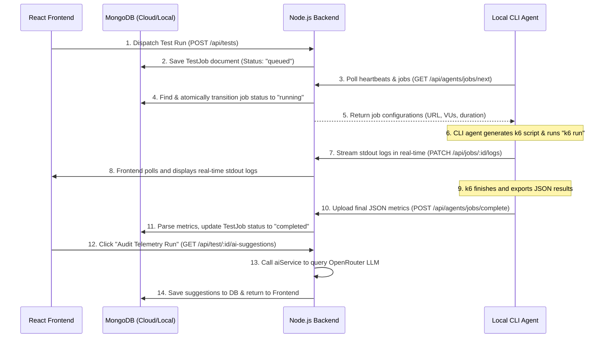

# K6 Lab Project Architecture Guide

Welcome to the **K6 Lab** architecture guide! This document is designed to help you understand the codebase structure, how the different components interact, and how to easily add new features in the future.

---

## 📂 Project Directory Structure

The project is structured as a modern, decoupled **monorepo** with three core directories:

```markdown
k6lab/
├── ARCHITECTURE.md          # This guide
├── package.json             # Root dependencies & scripts
├── backend/                 # Node.js + Express MVC server
│   ├── app.js               # Express app entry point
│   ├── config/              # Configuration (MongoDB connection)
│   ├── models/              # Mongoose database models
│   ├── controllers/         # API request handlers (Business Logic)
│   ├── routes/              # Express API route mapping
│   ├── middleware/          # Authentication & security middlewares
│   ├── services/            # Extracted third-party & heavy operations (e.g., AI)
│   └── utils/               # Math/string utility helper functions
├── frontend/                # Vite + React dynamic dashboard
│   ├── src/
│   │   ├── main.jsx         # React application mount
│   │   ├── App.jsx          # Route configuration
│   │   ├── pages/           # High-level full screen page views
│   │   ├── components/      # Reusable visual widgets & UI components
│   │   ├── services/        # Backend API integration layers (axios)
│   │   ├── context/         # React global states (Authentication context)
│   │   └── utils/           # Frontend layout & string formatters
└── agent/                   # Globally linked Node.js CLI runner
    ├── package.json         # CLI manifest (k6lab-agent)
    └── src/
        ├── index.js         # Commander CLI entry points
        ├── commands/        # CLI actions (login, start, status, logout)
        ├── services/        # Local systems communication (Runner, API)
        └── utils/           # Local validation & formatting utilities
```

---

## 🔄 Core Flow: How It Works

K6 Lab runs exclusively in **Agent Mode**. This guarantees zero-overhead server processing, as all heavy load tests run directly on the developer's laptop!



---

## 🛠️ Backend Architecture (Express MVC)

The backend follows the strict **Model-View-Controller (MVC)** pattern with isolated services to keep files lean and maintainable.

### 1. Database Schema (`backend/models/`)
- [User.js](file:///Users/jaykacha/Downloads/k6lab/backend/models/User.js): Manages developer accounts, tokens, and bcrypt hashed passwords.
- [Agent.js](file:///Users/jaykacha/Downloads/k6lab/backend/models/Agent.js): Tracks local agent tokens, dynamic status pings (`online`, `offline`), and heartbeat timers (`lastSeenAt`).
- [TestJob.js](file:///Users/jaykacha/Downloads/k6lab/backend/models/TestJob.js): Manages test details, raw parameters, logs, cached AI performance summaries, and final k6 metric reports.

### 2. Business Logic controllers (`backend/controllers/`)
- Contains handlers that consume inputs, query schemas, and return JSON responses.
- **Extensible rule**: Keep controllers lightweight. Heavy calculations or third-party integrations (like OpenRouter AI) are moved into `backend/services/`.

### 3. Modular Services (`backend/services/`)
- [aiService.js](file:///Users/jaykacha/Downloads/k6lab/backend/services/aiService.js): Houses OpenRouter API endpoints, positive constraint prompts, token configurations, and JSON communication.
- To add support for local AI models (Ollama) or different LLMs in the future, simply update the `aiService.js` file!

---

## 🎨 Frontend Architecture (React)

The frontend is built on **React + Vite** and structured logically:

### 1. Global State (`context/`)
- [AuthContext.jsx](file:///Users/jaykacha/Downloads/k6lab/frontend/src/context/AuthContext.jsx) manages global authentication, login/signup states, local storage cookies, and default axios authorizations.

### 2. Pages vs Components
- **`pages/`**: Full views loaded by React Router in [App.jsx](file:///Users/jaykacha/Downloads/k6lab/frontend/src/App.jsx) (e.g. `Dashboard.jsx`, `RunTest.jsx`).
- **`components/`**: Reusable interactive widgets. For example, `AgentOnboarding.jsx` handles copyable CLI tokens and configuration snippets.

### 3. Services API Integration (`services/`)
- Uses Axios configured in `api.js` to communicate with `http://localhost:8000/api`.
- Export service handlers in `testService.js` to decouple component rendering from endpoint paths.

---

## ➕ How to Add a New Feature: Step-by-Step

Let's say you want to add a **"Slack/Discord Webhook Notifications"** feature so users receive a message when a test completes.

### Step 1: Update the database model
Add `webhookUrl` to the `TestJob` or `User` model:
```javascript
// backend/models/TestJob.js
webhookUrl: {
  type: String,
  default: null
}
```

### Step 2: Add Controller & Route
Expose a new endpoint to save webhooks:
```javascript
// backend/controllers/testController.js
const updateWebhook = async (req, res) => {
  // Save webhook logic
};

// backend/routes/testRoutes.js
router.put("/tests/:id/webhook", protect, updateWebhook);
```

### Step 3: Extract Notification Logic into a Service
Create `backend/services/notificationService.js` to send messages:
```javascript
// backend/services/notificationService.js
const axios = require("axios");
const sendWebhookNotification = async (webhookUrl, job) => {
  await axios.post(webhookUrl, { content: `Stress test ${job.name} finished with failure rate of ${job.result.failedRequestRate * 100}%!` });
};
```

### Step 4: Trigger in Agent Controller
When the agent uploads results, invoke your new notification service:
```javascript
// backend/controllers/agentController.js
const { sendWebhookNotification } = require("../services/notificationService");

// inside uploadJobResult handler when job status becomes "completed":
if (job.webhookUrl) {
  sendWebhookNotification(job.webhookUrl, job).catch(console.error);
}
```

### Step 5: Add UI Input in Frontend
Create a simple input field in the React dashboard:
```jsx
// frontend/src/pages/RunTest.jsx
<input 
  placeholder="Enter Discord Webhook URL" 
  value={form.webhookUrl} 
  onChange={(e) => setForm({ ...form, webhookUrl: e.target.value })} 
/>
```
Add the field to your payload inside `handleRunTest` and dispatch!

---

## 💡 Pro Tips for Future Code Extensions

1. **Avoid Fat Controllers**: Always extract external calls, log streams, file reading, or script generation into files inside `services/`.
2. **Keep the Agent Simple**: The CLI agent should be a simple executor. It polls, runs k6, and uploads. Keep all dashboard business decisions, thresholds, and triggers inside the backend server.
3. **Graceful Error Handling**: Always wrap API responses in `{ success: true/false, data: ... }` to keep frontend parsing extremely robust and predictable.
