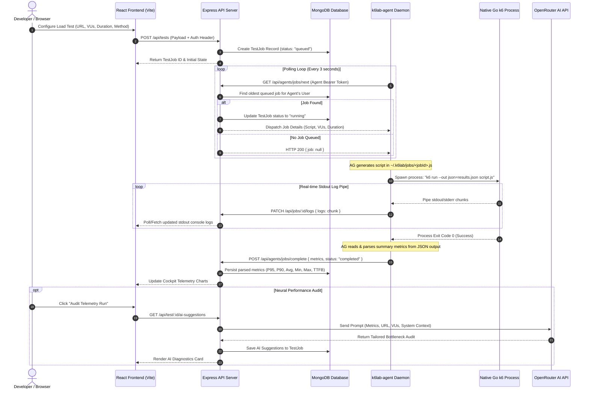

# 🏛️ K6 Lab — System Architecture & Design Manual

This document provides a comprehensive technical overview of the **K6 Lab** platform architecture, subsystem implementations, communication protocols, security boundaries, and extension guidelines for software engineers and architects.

---

## 📐 1. Architectural Philosophy

K6 Lab is built around three core architectural tenets:

1. **Local-First Execution Hierarchy**: Load generation is strictly decoupled from the central API server. By executing native Grafana `k6` Go binaries on developer hardware via a CLI daemon (`k6lab-agent`), K6 Lab achieves zero-cost server scaling, sub-millisecond metric fidelity, and seamless testing of private `localhost` or intranet VPC endpoints.
2. **Asynchronous Non-Blocking Telemetry**: Test execution, stdout log streaming, metric aggregation, and AI diagnostic audits are completely decoupled into asynchronous pipelines, ensuring zero UI latency and resilient system bounds.
3. **Stateless Central Coordination**: The central Express API server acts strictly as a telemetry coordinator, queue dispatcher, and AI auditing broker, persisting state in MongoDB while delegating execution to authenticated edge agents.

---

## 🗂️ 2. Subsystem Layout & File Map

```
k6lab/
├── backend/                       # Central Telemetry Coordinator (Express + MongoDB)
│   ├── app.js                     # Server instantiation & middleware stack
│   ├── config/
│   │   └── db.js                  # Mongoose MongoDB connection pooling
│   ├── controllers/
│   │   ├── agentController.js     # Agent heartbeats, job polling & log ingestion
│   │   ├── aiController.js        # Neural audit triggering & response mapping
│   │   ├── authController.js      # Developer signup, login & token management
│   │   ├── projectController.js   # Project & folder workspace management
│   │   └── testController.js      # Load test creation, deletion & fetching
│   ├── middleware/
│   │   ├── authMiddleware.js      # JWT token verification for UI requests
│   │   └── errorMiddleware.js     # Centralized exception formatter
│   ├── models/
│   │   ├── Agent.js               # Agent daemon state & SHA-256 token hashes
│   │   ├── Folder.js              # Nested folder workspace schema
│   │   ├── Project.js             # Project workspace schema
│   │   ├── TestJob.js             # Load test run metrics, logs & AI diagnosis
│   │   └── User.js                # Developer account credentials
│   ├── routes/
│   │   ├── agentRoutes.js         # Edge agent REST endpoints
│   │   ├── aiRoutes.js            # Neural audit endpoints
│   │   ├── authRoutes.js         # Auth routes
│   │   ├── projectRoutes.js      # Workspace management routes
│   │   └── testRoutes.js         # Load test management routes
│   └── services/
│       └── aiService.js           # OpenRouter LLM integration client
│
├── frontend/                      # User Cockpit SPA (Vite + React 19 + Tailwind CSS)
│   ├── src/
│   │   ├── App.jsx                # React Router v7 routes & global overlays
│   │   ├── main.jsx               # DOM mount point
│   │   ├── components/
│   │   │   ├── AIAnalysis.jsx     # AI diagnosis card & telemetry audit triggers
│   │   │   ├── AgentOnboarding.jsx# Token generation & CLI onboarding widget
│   │   │   ├── AnimatedList.jsx   # Animated list with 315px 4-item scroll viewport
│   │   │   ├── ClickSpark.jsx     # Interactive spark physics overlay
│   │   │   ├── CurvedLoop.jsx     # WebGL/SVG curved text marquee loop
│   │   │   ├── HeroDashboard.jsx  # Interactive hero cockpit demonstration
│   │   │   ├── Lanyard.jsx        # 3D physics ID badge component (Three.js/Rapier)
│   │   │   ├── LaserFlow.jsx      # WebGL Shader ambient laser background
│   │   │   ├── Navbar.jsx         # Global navigation bar
│   │   │   ├── Footer.jsx         # Site footer with legal routes
│   │   │   ├── TargetCursor.jsx   # Custom crosshair cursor tracking
│   │   │   └── TelemetryBento.jsx # Bento grid feature showcase
│   │   ├── context/
│   │   │   └── AuthContext.jsx    # Authentication & token state provider
│   │   ├── pages/
│   │   │   ├── Analytics.jsx      # Historical performance trends & graphs
│   │   │   ├── Dashboard.jsx      # Overview dashboard & 4-item test run feed
│   │   │   ├── History.jsx        # Full-height scrollable test execution history
│   │   │   ├── HomePage.jsx       # Landing page (LaserFlow + CurvedLoop + HeroDashboard)
│   │   │   ├── PrivacyPage.jsx    # Privacy Policy compliance page
│   │   │   ├── ProjectDetailsPage.jsx # Folder & test management inside projects
│   │   │   ├── ProjectsPage.jsx   # Workspace projects overview
│   │   │   ├── RunTest.jsx        # Scenario execution & live telemetry cockpit
│   │   │   └── TermsPage.jsx      # Terms of Service compliance page
│   │   ├── services/
│   │   │   ├── api.js             # Axios instance configured with Auth headers
│   │   │   └── testService.js     # Test execution API service layer
│   │   └── utils/
│   │       └── cardTextures.js    # Canvas texture generator helper
│   └── vite.config.js             # Vite config with assetsInclude: ['**/*.glb']
│
└── agent/                         # CLI Daemon Package (k6lab-agent)
    └── src/
        ├── index.js               # Commander CLI entrypoint
        ├── commands/
        │   ├── login.js           # Agent token auth & local config storage
        │   ├── logout.js          # Credentials clearing
        │   ├── start.js           # Polling loop & heartbeat daemon
        │   └── status.js          # Local agent status check
        └── services/
            ├── apiService.js      # Backend API communication
            └── runnerService.js   # Native k6 process spawner & stdout streamer
```

---

## 🔄 3. Detailed Data Flow & Execution Pipeline



---

## 🧱 4. Subsystem Technical Breakdown

### A. Backend Subsystem (`backend/`)
- **Technology Stack**: Node.js, Express.js, Mongoose ODM, MongoDB, JSON Web Tokens (JWT), Axios.
- **RESTful Endpoints**:
  - `POST /api/auth/register`, `POST /api/auth/login`: User management.
  - `POST /api/tests`, `GET /api/tests`: Scenario creation and listing.
  - `GET /api/agents/jobs/next`: Atomic job dispatch endpoint used by CLI daemons.
  - `PATCH /api/jobs/:id/logs`: Log streaming endpoint for agent stdout.
  - `POST /api/agents/jobs/complete`: Metric ingestion endpoint.
  - `GET /api/test/:id/ai-suggestions`: OpenRouter AI telemetry audit endpoint.

### B. Frontend Subsystem (`frontend/`)
- **Technology Stack**: React 19, Vite, Tailwind CSS v4, Framer Motion, Lucide Icons, OGL / Three.js.
- **Component Architecture**:
  - **`LaserFlow.jsx`**: Custom WebGL shader rendering reactive laser beam background animations tailored to the `#F43F5E` palette.
  - **`CurvedLoop.jsx`**: Interactive SVG text marquee animating along a parabolic bézier curve (`pathD`).
  - **`AnimatedList.jsx`**: Viewport-constrained (315px) list container showing exactly 4 item cards initially with smooth gradient masks and vertical scrolling.
  - **`HeroDashboard.jsx`**: Interactive demonstration cockpit with real-time metric tickers, latency sparklines, and k6 script tab editor.

### C. Agent Daemon Subsystem (`agent/`)
- **Technology Stack**: Commander.js, Axios, Node.js `child_process.spawn`.
- **Workflow**:
  1. `k6lab-agent login <token>`: Authenticates agent token against backend and saves config to `~/.k6lab/config.json`.
  2. `k6lab-agent start`: Initiates polling loop and status heartbeats (`online` status updated every 5s).
  3. `runnerService.js`: Dynamically constructs ES6 k6 test scripts, executes the native `k6` binary, streams stdout in chunks, parses JSON metric output, and posts results.

---

## 🔒 5. Security & Isolation Architecture

1. **SHA-256 Token Protection**:
   Agent authentication tokens are generated as 64-character hex strings, and stored in MongoDB only as one-way **SHA-256 hashes**.
2. **Execution Directory Isolation**:
   The CLI agent executes all test scripts strictly inside `~/.k6lab/jobs/` and has zero permission or code logic to touch system directories.
3. **No Database Secrets at Edge**:
   The agent daemon operates entirely through authenticated HTTP REST APIs using bearer tokens. Database connection strings, Atlas cluster keys, and OpenRouter API secrets remain isolated on the central Express server.

---

## 🛠️ 6. Guidelines for Extending the System

### Adding a New Metric Collector:
1. Update `backend/models/TestJob.js` schema under the `result` sub-document.
2. Update `agent/src/services/runnerService.js` to extract the metric from k6 JSON export output.
3. Update `frontend/src/pages/RunTest.jsx` and `HeroDashboard.jsx` to display the metric card.

### Adding a New AI Model Integration:
1. Open `backend/services/aiService.js`.
2. Update `model` parameter or append fallback logic in `generatePerformanceSuggestions(testJob)`.
