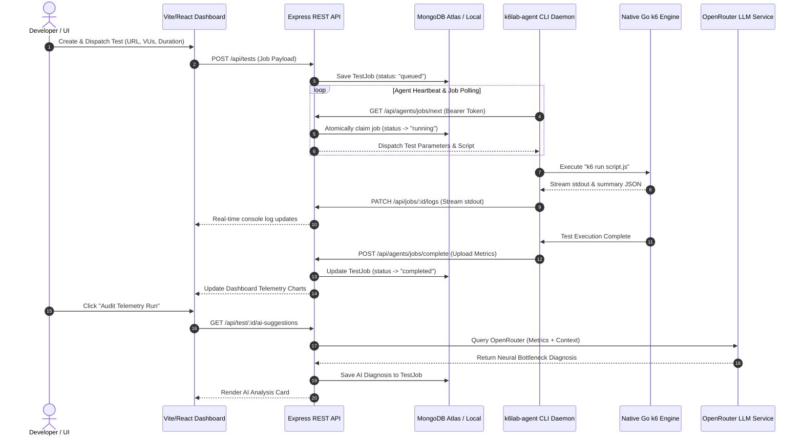

# ⚡ K6 Lab — Local-First Load Testing Platform v2.4

[](https://nodejs.org/)
[](https://vitejs.dev/)
[](https://react.dev/)
[](https://k6.io/)
[](LICENSE)

> **K6 Lab** is a high-performance, local-first API load-testing platform and real-time telemetry cockpit. Designed for developers and platform engineers, K6 Lab combines local Go `k6` engine execution with centralized control, live latency distribution telemetry, and instant AI root-cause failure diagnosis.

---

## 📸 Architectural Overview

K6 Lab operates on a **Local-First Daemon Architecture**. Instead of routing load test traffic through expensive cloud runners or third-party proxies, test scripts are executed natively on your local machine or internal VPC hardware via the lightweight `k6lab-agent` CLI daemon.

```
┌─────────────────────────────────────────────────────────────────────────────┐
│                           K6 LAB SYSTEM TOPOLOGY                            │
├──────────────────────────┬──────────────────────────────────────────────────┤
│ LOCAL DEVELOPER HARDWARE │ CENTRALIZED TELEMETRY & COCKPIT                  │
│                          │                                                  │
│  ┌────────────────────┐  │   ┌────────────────────┐   ┌───────────────────┐ │
│  │   k6lab-agent CLI  │  │   │  Express API Server│   │  MongoDB Database │ │
│  │   (Daemon Process) │  │   │ (Port 8000 Engine) │   │ (Cloud or Local)  │ │
│  └─────────┬──────────┘  │   └─────────▲──────────┘   └─────────▲─────────┘ │
│            │             │             │                        │           │
│  ┌─────────▼──────────┐  │             │                        │           │
│  │   Native Go k6     │  │   ┌─────────┴──────────┐             │           │
│  │  (Load Engine)     ├──┼──►│  Vite/React UI     ├─────────────┘           │
│  └────────────────────┘  │   │  (Dark Cockpit)    │                         │
│                          │   └────────────────────┘                         │
└──────────────────────────┴──────────────────────────────────────────────────┘
```

---

## 🌟 Key Features

### 💻 Local-First Daemon Execution (`k6lab-agent`)
- **Zero Firewall Setup**: Stress-test `localhost`, internal VPC endpoints, and private staging APIs directly from your machine.
- **Native Performance**: Leverages Grafana's Go-based `k6` load generation engine for sub-millisecond metric precision and zero virtualization overhead.
- **Isolated Sandbox**: Test jobs execute within sandboxed user directories (`~/.k6lab/jobs/`) with automated cleanup.

### 📈 Live Telemetry Cockpit & Metrics
- **Real-Time Latency Histograms**: Continuous tracking of `P95`, `P90`, `Average`, `Min`, and `Max` response times.
- **HTTP Network Breakdown**: Detailed connection metrics including TTFB (Time To First Byte), DNS lookup, TLS handshake, TCP connection, and sending/receiving delays.
- **Live Stdout Console Stream**: Live logs piped directly from the agent daemon into an interactive dark terminal console.
- **Configurable Viewports**: 4-item scrollable viewport queues for recent test runs with animated entry transitions.

### 🧠 Neural Performance Audit (AI Root-Cause Diagnosis)
- **Instant AI Diagnosis**: On-demand LLM analysis via **OpenRouter** (`nvidia/nemotron-nano-9b-v2:free`).
- **Actionable Insights**: Pinpoints bottleneck causes (e.g., database connection pool exhaustion, event-loop blocking, or unindexed queries) without generic boilerplate advice.
- **Resource Recommendations**: Gives specific guidance on scaling Virtual Users (VUs) and test duration safely.

### 📁 Workspace & Project Hierarchy
- **Project & Folder Organization**: Group load test scenarios into logical project folders and workspaces.
- **Script Management**: Embedded JavaScript k6 script editor with syntax highlighting and instant parameter override.

### ✨ Premium Aesthetic & UX Design System
- **WebGL LaserFlow Shader**: Ambient WebGL background effect on the landing page matching the rose-red accent system (`#F43F5E`).
- **CurvedLoop Interactive Marquee**: Draggable 3D curved text marquee displaying core technical capabilities.
- **Interactive Cursor & Effects**: Site-wide `TargetCursor` crosshair physics and `ClickSpark` visual feedback.
- **Legal Infrastructure**: Fully integrated Privacy Policy and Terms of Service pages with global footer routing.

---

## 🔄 End-to-End Execution Sequence



---

## 🛠️ Repository Layout

```
k6lab/
├── backend/                  # Node.js + Express MVC Telemetry API
│   ├── config/               # Database connection setup
│   ├── controllers/          # Business logic handlers
│   ├── middleware/           # JWT auth & error handling
│   ├── models/               # Mongoose schemas (User, Agent, TestJob, Project, Folder)
│   ├── routes/               # API endpoint routing
│   └── services/             # AI service integrations & utilities
├── frontend/                 # Vite + React SPA Dashboard
│   ├── src/
│   │   ├── components/       # UI widgets (LaserFlow, CurvedLoop, HeroDashboard, AnimatedList)
│   │   ├── context/          # Global state (AuthContext)
│   │   ├── layouts/          # Dashboard MainLayout frame
│   │   ├── pages/            # Full-page views (HomePage, Dashboard, RunTest, History, etc.)
│   │   └── services/         # Axios API clients
│   └── vite.config.js        # Vite bundler configuration
└── agent/                    # CLI Daemon Package (k6lab-agent)
    └── src/
        ├── commands/         # CLI commands (login, start, status, logout)
        ├── services/         # Agent API client & k6 process manager
        └── index.js          # Commander CLI entrypoint
```

---

## ⚙️ Prerequisites

Before getting started, ensure you have the following installed:

- **Node.js**: v18.0.0 or higher
- **npm** / **pnpm**: Node package manager
- **MongoDB**: Local MongoDB server or a MongoDB Atlas URI string
- **Grafana k6**: Native load generation engine
  - **macOS**: `brew install k6`
  - **Linux**: `sudo apt-key adv --keyserver hkp://keyserver.ubuntu.com:80 ...` (See [k6 Installation Guide](https://k6.io/docs/get-started/installation/))
  - **Windows**: `winget install k6` or `choco install k6`

---

## 🚀 Quickstart Guide

### 1. Configure & Start Backend API
```bash
cd backend
npm install
```

Create a `.env` file in `backend/`:
```env
PORT=8000
MONGO_URI=mongodb://localhost:27017/k6lab
JWT_SECRET=your_jwt_secret_key_here
OPENROUTER_API_KEY=your_openrouter_api_key_here
```

Start the backend dev server:
```bash
npm run dev
# Server running on http://localhost:8000
```

### 2. Configure & Launch Frontend Dashboard
```bash
cd ../frontend
npm install
npm run dev
# Dashboard running on http://localhost:5173
```

### 3. Connect the `k6lab-agent` CLI Daemon
Link or install the CLI agent globally:
```bash
cd ../agent
npm link
```

Generate an Agent Token from the frontend dashboard (**Dashboard -> Agent Onboarding**), then run:
```bash
k6lab-agent login <YOUR_AGENT_TOKEN>
k6lab-agent start
```

*The agent daemon is now online, listening for dispatched load tests!*

---

## 🔐 Security Architecture

- **SHA-256 Token Hashing**: Agent authentication tokens are stored using one-way SHA-256 hashes on the database.
- **Zero Credentials on Agent**: The CLI daemon requires zero database URIs or private keys to run.
- **Local Directory Scoping**: Test scripts are generated and cleaned up in isolated `~/.k6lab/jobs/` working paths.
- **Encrypted Communications**: All communications between the dashboard, agent daemon, and API use standard TLS/HTTPS.

---

## 📄 License

Distributed under the MIT License. See `LICENSE` for details.
