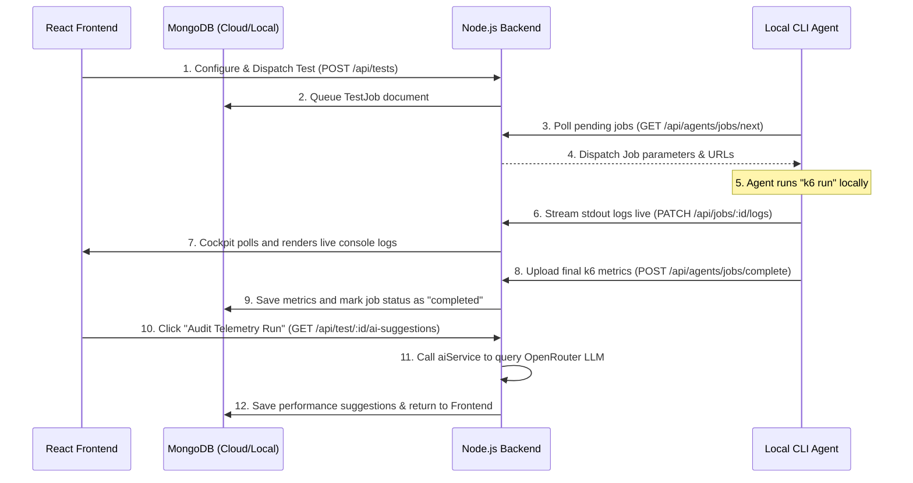

# 📊 K6 Lab

> **AI-Powered Local Load-Testing & Real-Time Telemetry Cockpit**

K6 Lab is a modern, high-performance load-testing platform built on an **Agent-Only Architecture**. By offloading all stress runs locally to developers' machines via the `k6lab-agent` CLI, the platform eliminates server overhead, handles native `k6` executions seamlessly, and streams live telemetry, timing breakdowns, and stdout logs directly to a beautiful dark-mode React cockpit.

Additionally, K6 Lab features a **Neural Performance Audit**—an on-demand, AI-powered diagnostics panel that audits your test results to provide simple, actionable feedback and direct recommendations to push your endpoints to their actual performance limits!

---

## 🧠 Core Features

* **🤖 Neural Performance Audit (AI-Powered)**: 
  * Powered by state-of-the-art LLMs via **OpenRouter** (`nvidia/nemotron-nano-9b-v2:free`).
  * Delivers highly context-specific, direct performance audits tailored strictly to your metrics and endpoint.
  * **Zero textbook clutter**: Cryptographically configured to ignore boring boilerplate tips like *"Profile dependencies"* or *"Add failure scenarios"*.
  * **Actionable Scale Recommendations**: Congratulates you on clean, healthy runs and guides you directly on how to scale VUs (e.g., to 20 or 50 VUs) and duration to explore actual system boundaries.
  * **Interactive-Only**: Runs *only* when you click the **"Audit Telemetry Run"** button, preventing unwanted automatic API calls.
* **💻 Decoupled Local CLI Agent (`k6lab-agent`)**:
  * Offloads execution to your machine—allowing you to stress-test private/local endpoints (like `http://localhost:5000/api`) that servers cannot reach.
  * Emits lightweight 5-second heartbeats and atomically polls database queues.
  * Streams raw stdout logs back to the dashboard in real-time.
* **📈 Real-Time Telemetry Cockpit**:
  * Instantly monitors **Average, P90, P95, Min, and Max Latencies**.
  * Displays **Total Requests, Successful OKs, Failed Errors, and Failure Rates**.
  * Breaks down network performance with **TTFB (Waiting), Blocked Delay, Sending, Receiving, TLS Handshake, and Connecting times**.
  * Real-time scrolling stdout log console streaming directly from the active agent thread.

---

## 📂 Project Architecture

The project consists of three core workspaces:

1. **`backend/`**: A Node.js + Express MVC server acting as the central telemetry coordinator.
2. **`frontend/`**: A Vite + React responsive SPA dashboard loaded with modern dark glassmorphism styling and rich cyberpunk visual assets.
3. **`agent/`**: A globally linkable Commander.js CLI runner published on npm as `k6lab-agent`.

---

## 🔄 Sequence Workflow



---

## ⚙️ Prerequisites

Ensure you have the following installed on your machine:
* **Node.js** (v16+)
* **MongoDB** (Local instance running or a MongoDB Atlas connection string)
* **Grafana k6** (Native load-testing tool)
  * *Mac*: `brew install k6`
  * *Windows*: `choco install k6`
  * *Alternatives*: Download directly from [k6.io](https://k6.io/docs/get-started/installation/)

---

## 🚀 Getting Started

Follow these steps to run the complete K6 Lab platform locally:

### 1. Set Up the Backend Server
Navigate to the `backend` directory, install dependencies, configure your environment, and start the server:
```bash
cd backend
npm install
```
Create a `.env` file in the `backend/` folder:
```env
PORT=8000
MONGO_URI=mongodb+srv://your_mongo_connection_string
JWT_SECRET=your_secure_jwt_encryption_secret
OPENROUTER_API_KEY=your_openrouter_api_token
```
Start the server in development mode:
```bash
npm run dev
```
*The API will run at `http://localhost:8000`.*

### 2. Set Up the React Frontend
Navigate to the `frontend` directory, install dependencies, and start the Vite dev server:
```bash
cd ../frontend
npm install
npm run dev
```
*The dashboard portal will open at `http://localhost:5173`. Sign up for an account to enter the dashboard!*

### 3. Connect Your Local CLI Agent
Install the global CLI agent directly from npm:
```bash
npm install -g k6lab-agent
```
Go to your K6 Lab dashboard onboarding screen, click **Generate Agent Token**, and run:
```bash
k6lab-agent login your_onboard_token
k6lab-agent start
```
*Leave the agent terminal open. It will show "Online" on your dashboard and wait to execute your dispatched stress runs!*

---

## 🔐 Security Safeguards

* **Token-Hashing**: Agent tokens are matched on the Mongoose backend using secure, one-way **SHA-256 hashes**.
* **Zero Secrets Leakage**: Database coordinates, Atlas paths, and API keys are strictly stored on the server's private `.env` (fully ignored by `.gitignore`). The CLI agent needs zero credentials to run tests.
* **Isolated Scripting**: The agent only runs scripts generated inside `~/.k6lab/jobs/` and has no authority to access other directories on the developer's computer.
